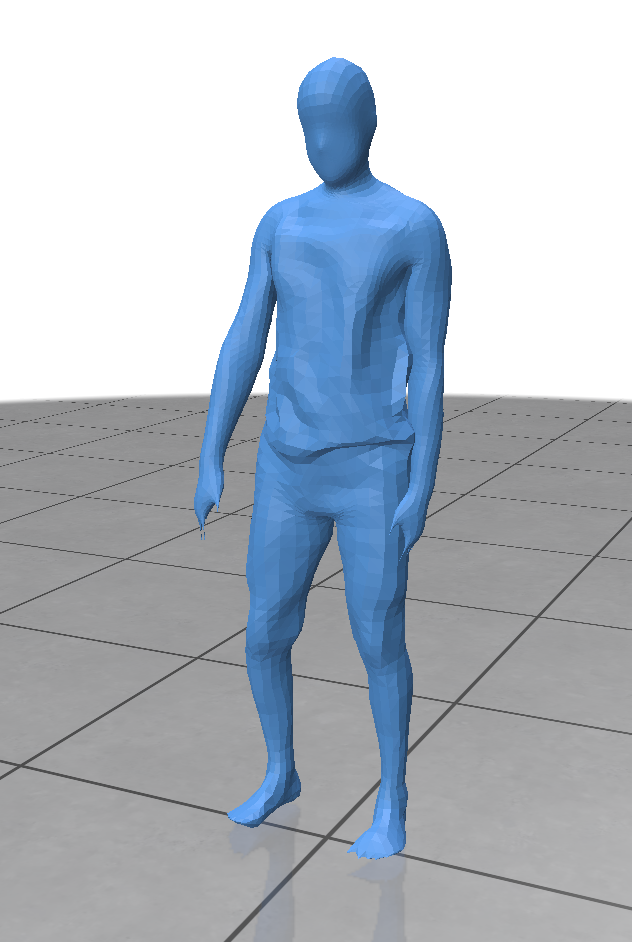

# VertexFlow
EEL7680 Programming Assignment 1

## Table of Contents
1. [Introduction](#introduction)
2. [Mesh Processing Functions](#mesh-processing-functions)
    - [Compute Laplacian](#compute-laplacian)
    - [Compute Mean Curvature](#compute-mean-curvature)
    - [Laplacian Smoothing](#laplacian-smoothing)
3. [Mesh Correspondence](#mesh-correspondence)
4. [Visualization](#visualization)
5. [Usage](#usage)
6. [Results](#results)
7. [Conclusion](#conclusion)

## Introduction
This project involves various mesh processing techniques including computing the Laplacian, mean curvature, Laplacian smoothing, and finding mesh correspondences using spectral embeddings. The goal is to understand and implement these techniques and visualize the results.

## Mesh Processing Functions

### Compute Laplacian
The Laplacian matrix is a key component in many mesh processing algorithms. It is computed as \( L = A^{-1}M \), where \( A \) is the diagonal area weight matrix and \( M \) is the sparse weight mass matrix.

### Compute Mean Curvature
Mean curvature is computed using the Laplacian of the vertex positions. The mean curvature vector is given by \( \Delta X \), and the mean curvature magnitude is half the norm of this vector.

### Laplacian Smoothing
Laplacian smoothing is performed using spectral decomposition. The smoothed vertex positions are obtained by solving the equation \( (I - \lambda L)X = V \).

## Mesh Correspondence
Point-to-point correspondences between two meshes are found by matching the spectral embeddings of the points. The functional map is computed, and nearest neighbors are found in the spectral space.

## Visualization
Polyscope is used for visualizing the meshes and the correspondences. The following images show the results of various visualizations:

### Eigenfunctions


### Normals


### Mean Curvature


### Spectral Smoothing


### Mesh Correspondences


## Usage
To run the interactive script, use the following command:
```sh
python main.py